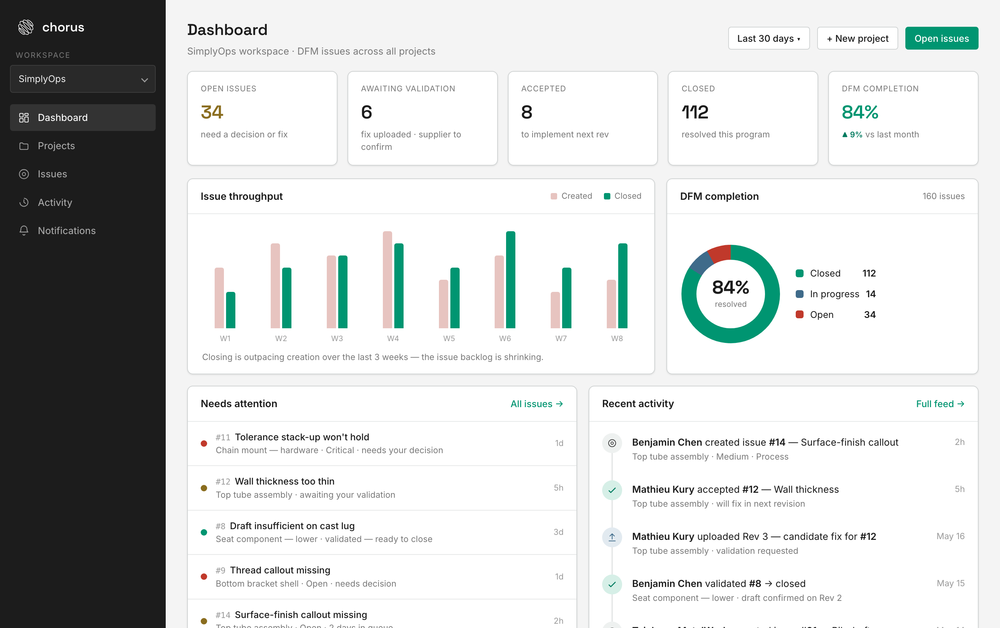
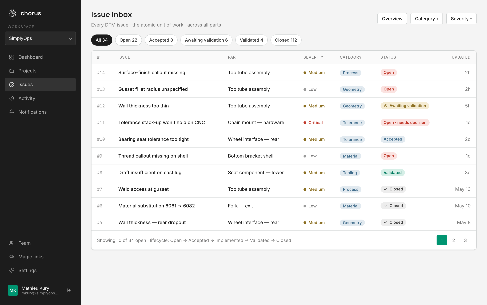
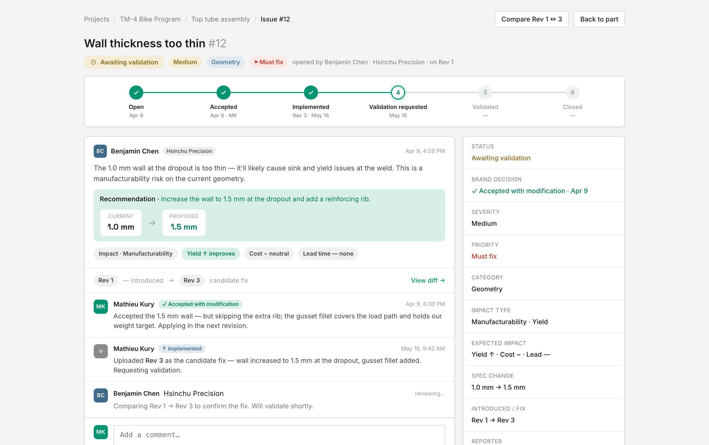
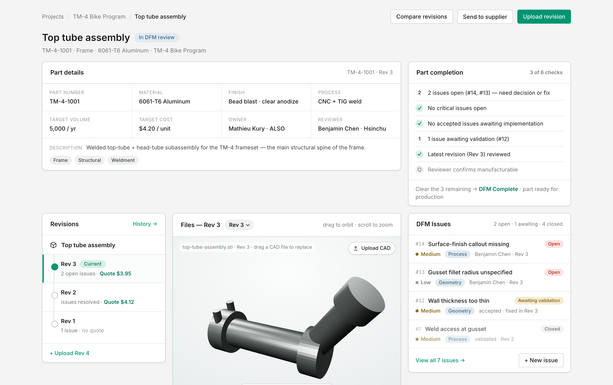
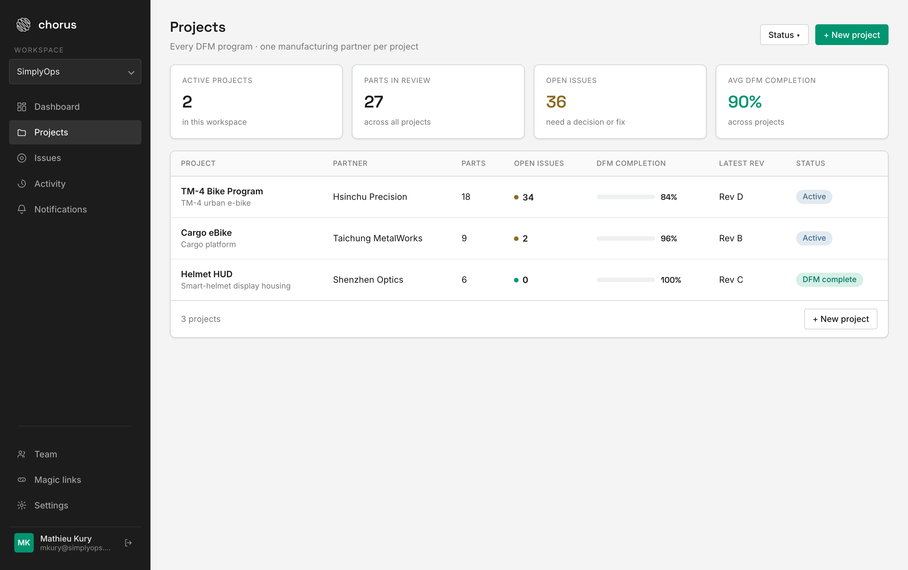
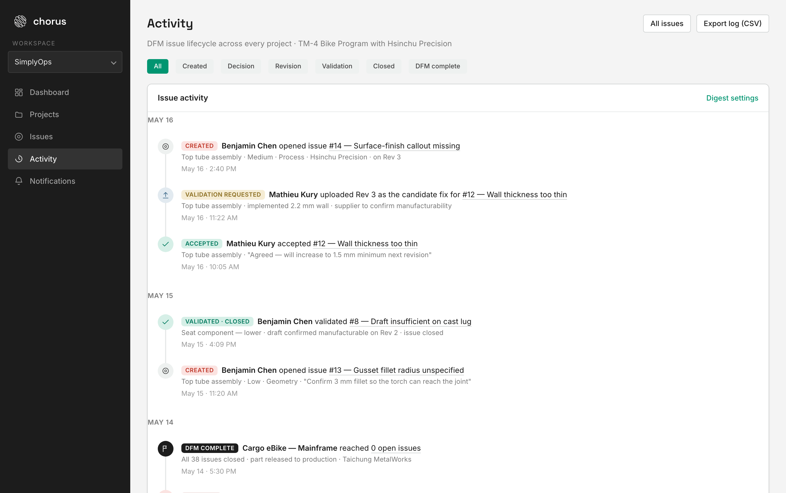
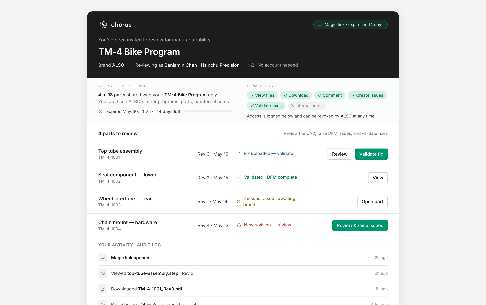
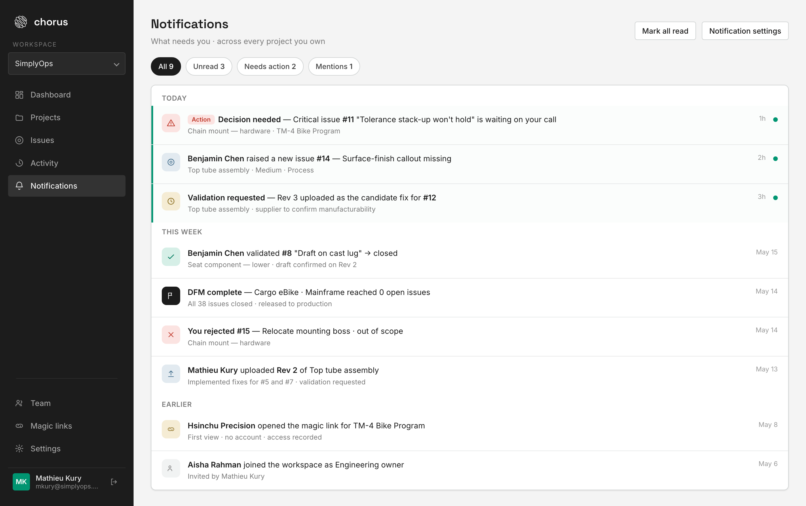
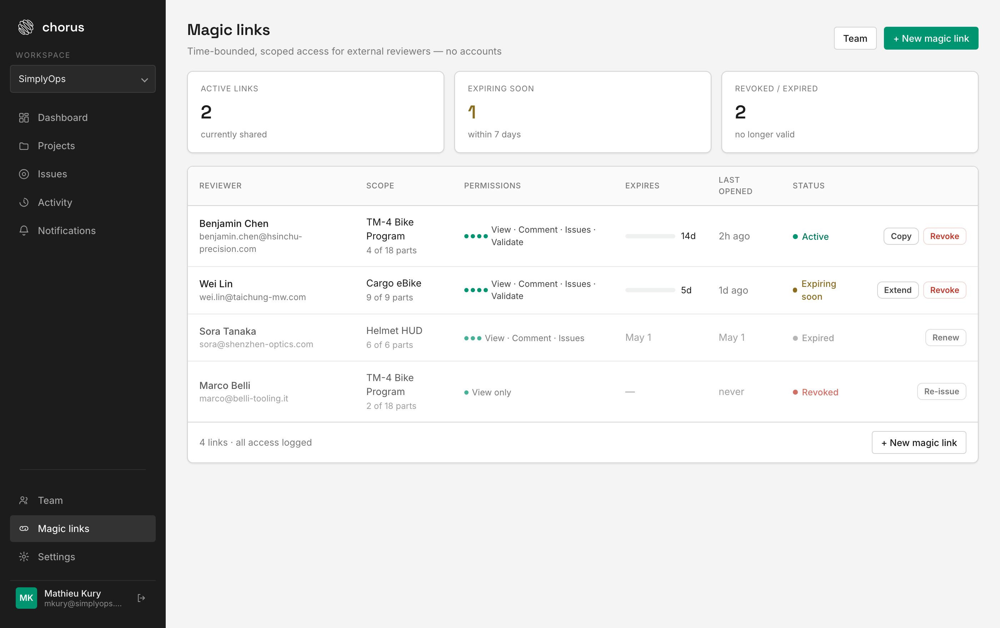
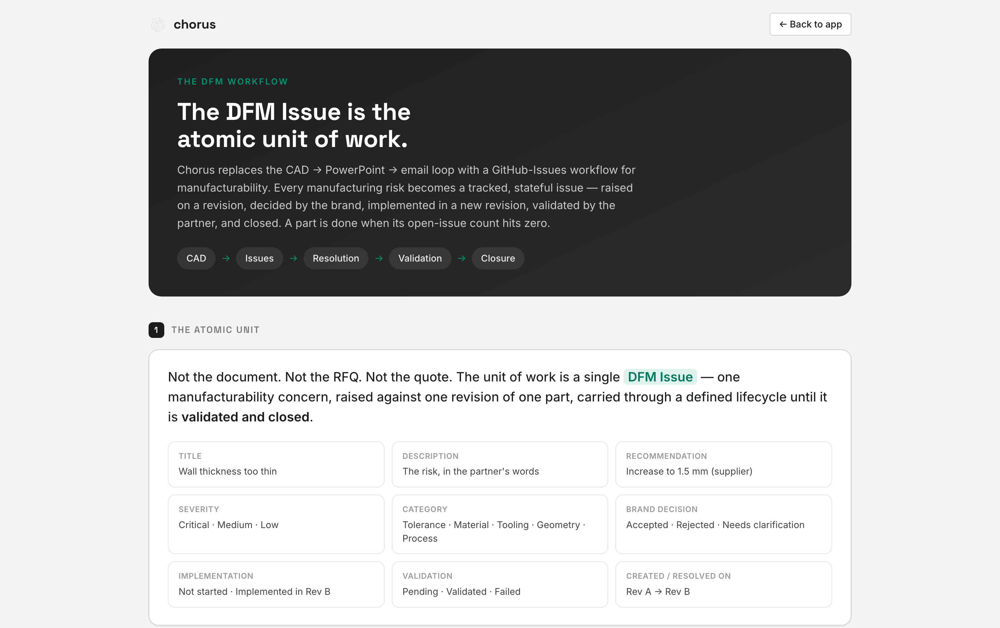

# Chorus

> **DFM as a workflow — not a slide deck.**
> A GitHub-Issues-style system for Design-for-Manufacturability between a brand and its manufacturing partner.

**Live:** **[withchorus.ai](https://withchorus.ai)**

Chorus replaces the **CAD → PowerPoint → email** loop that DFM review usually lives in. Every manufacturing risk becomes a tracked, stateful **issue** — raised on a revision, decided by the brand, implemented in a new revision, validated by the partner, and closed. A part is done when its open-issue count hits zero.

> **The DFM Issue is the atomic unit of work.**  `CAD → Issues → Resolution → Validation`



---

## The model

**Hierarchy**

```
Workspace → Project → Part → Revision → DFM Issue → Decision → Validation → Closure
```

**Issue lifecycle — the state machine**

```
Open → Accepted → Implemented → Validation requested → Validated → Closed
 ├─ Open → Rejected                              (terminal)
 ├─ Open → Needs clarification → Open            (loop)
 └─ Validation requested → Validation failed → Open
```

Each issue carries: title, description, supplier recommendation, **severity** (Critical/Medium/Low), **category** (Tolerance/Material/Tooling/Geometry/Process), **priority**, **impact type**, current → proposed values, the brand **decision** (Accept / Accept-with-modification / Reject / Needs clarification), implementation status, validation status, and the revisions it was *introduced on* and *fixed in*.

**Two actors, one source of truth**

| Brand (e.g. ALSO) | Manufacturing partner (e.g. Hsinchu Precision) |
|---|---|
| Owns design intent | Owns manufacturability |
| Creates projects, parts, uploads revisions | Reviews revisions, raises DFM issues |
| Decides every issue, implements fixes | Validates fixes, confirms manufacturable |
| *Cannot validate its own fixes* | *Scoped — cannot see unrelated projects* |

---

## Screens

### Issue Inbox & Issue Detail — the atomic unit
The full DFM ledger, and a single issue with its lifecycle stepper, decision thread, spec change, and validation action.

| Issue Inbox | Issue Detail |
|---|---|
|  |  |

### Part Detail
Metadata, a 6-point **completion checklist** (the part is DFM-complete at zero open issues), per-revision issue counts, an in-browser **CAD viewer**, and the part's DFM issues.



### Projects & Activity

| Projects | Activity feed |
|---|---|
|  |  |

### External Reviewer Portal
A scoped, no-account **magic link** for the manufacturing partner — permissions matrix, link expiry, and an audit log. They review the CAD, raise issues, and validate fixes.



### Notifications & Magic-link management

| Notifications | Magic links |
|---|---|
|  |  |

### Workflow reference
The object hierarchy, the issue state machine, and the 12-step process — printed in-app.



---

## Tech

- **Static HTML / CSS / JS** — no build step, no framework, no backend.
- **Three.js** CAD viewer (STEP/STL/GLB/OBJ, orbit + drag-drop) on Part Detail.
- **Pure CSS/SVG charts** — donut, bars, progress (no chart library, clean Figma import).
- **`localStorage`** store (`store.js`) so created projects/parts/links persist as you navigate.
- Shared **`sidebar.js`** (nav + workspace switcher) and **`switcher.js`** (a dev-only screen jumper; append `#noswitch` to any URL to hide it).
- Hosted on **GitHub Pages** at the apex domain `withchorus.ai`.

## Run locally

No dependencies — just serve the folder:

```bash
python3 -m http.server 4599
# open http://localhost:4599
```

## Project structure

```
overview.html ......... Dashboard (issue KPIs, throughput, completion)
projects.html ......... Projects index
project-detail.html ... a Project → its parts
part-detail.html ...... Part hub (metadata, completion, CAD, issues, revisions)
issues-list.html ...... Issue Inbox (GitHub-style)
issue-detail.html ..... a DFM Issue + lifecycle state machine   <- the atomic unit
revision-history.html . a part's revision timeline
revision-diff.html .... Rev <-> Rev compare
magic-link-view.html .. External Reviewer Portal (scoped magic link)
activity.html ......... Issue lifecycle feed
notifications.html .... Actionable inbox
team.html ............. Team management (roles + external reviewers)
magic-links.html ...... Magic-link admin (scope, permissions, expiry)
create-project.html ... New-project form
user-flow.html ........ Workflow tree + state machine + 12 steps
settings.html | login.html | signup.html
store.js | sidebar.js | switcher.js | flows.js | styles.css
```

---

*Prototype — front-end only, seeded with a worked example (the **TM-4 Bike Program** between **ALSO** and **Hsinchu Precision**).*
